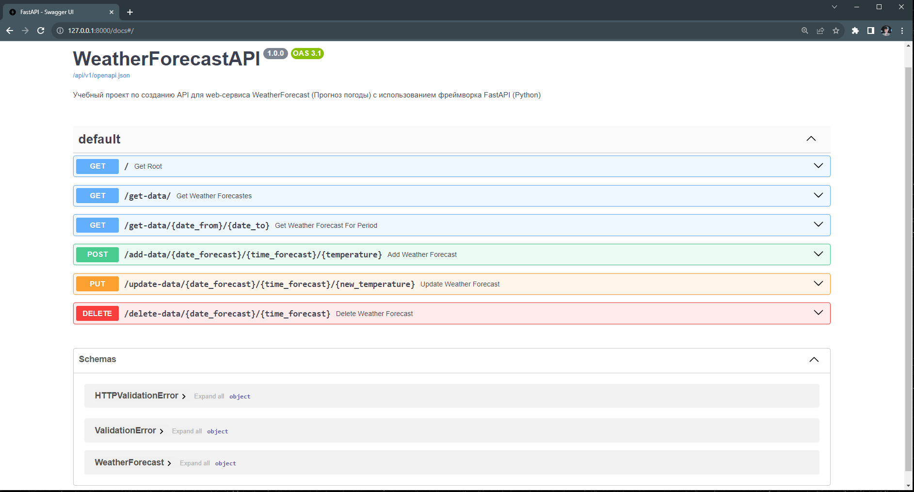

# Архитектура ПО (семинары)

------

## Урок 9. Способы организации передачи данных между компонентами приложения, протоколы и API. REST, gRPC, очереди
### Доработать Web-приложение, разработанное на уроке, добавить поддержку обработки запроса на обновление и удаление данных (http запросы PUT и DELETE), доработать компонент [**WeatherForecastHolder**](models/weather_forecast_holder.py "Ссылка на файл") по части удаления данных.

----------

### Реализовано в [**main.py**](main.py "Ссылка на файл")
### Для реализации проекта потребовались следующие библиотеки, перечисленные в [**requirements.txt**](requirements.txt "Ссылка на файл"). Для быстрой установки необходимо выполнить команду:
    pip install -r requirements.txt  